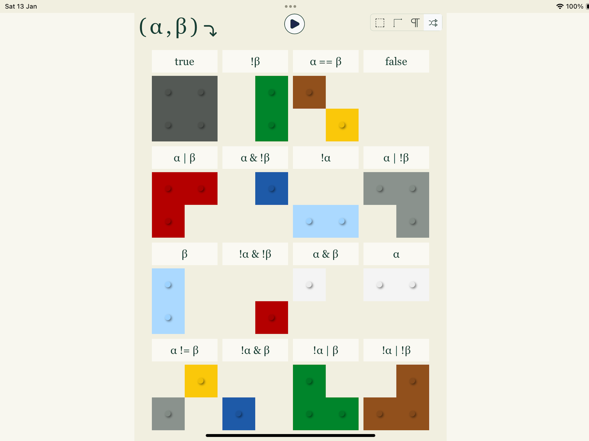

Le nouveau jeu à la mode : [ἀλήθεια](https://truth.cthiebaud.com/).

La référence à Martin Heidegger est flagrante : « <i>En traduisant ἀλήθεια par Unverborgenheit, dévoilement ou plutôt non-voilement, et non plus simplement par “Vérité”, Heidegger s'efforce de faire entendre quelque chose du sens, de ce vers quoi ἀλήθεια faisait signe, même à l'insu des Grecs, et à partir duquel ils déployaient leur monde (le monde d'Homère et des premiers penseurs et poètes).</i> » ⁽¹⁾.

Il s'agit donc de dévoiler les petites briques colorées pour faire apparaître ce que l'on appelle les tables de vérité ⁽²⁾ en jargon mathématique.

1. https://fr.wikipedia.org/wiki/Al%C3%A8theia_dans_la_philosophie_de_Martin_Heidegger
1. https://fr.wikipedia.org/wiki/Table_de_v%C3%A9rit%C3%A9

