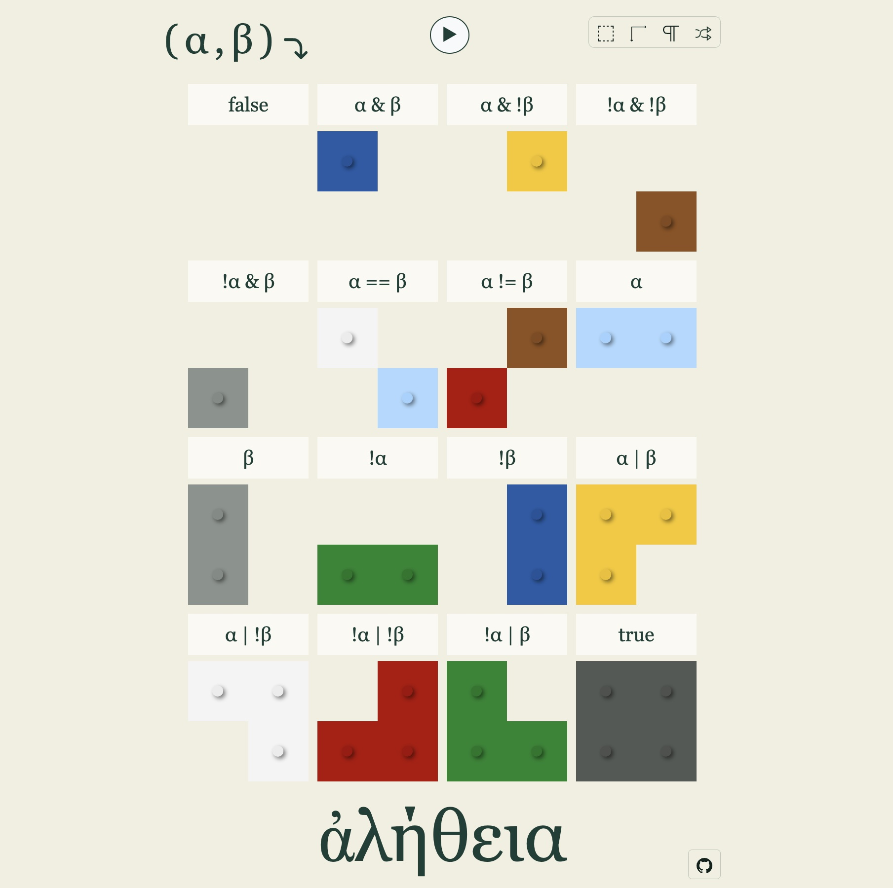

Le nouveau jeu à la mode : https://truth.cthiebaud.com/

La référence à l'ἀλήθεια de Martin Heidegger est flagrante, cf. « [𝐻𝑒𝑖𝑑𝑒𝑔𝑔𝑒𝑟], 𝑒𝑛 𝑡𝑟𝑎𝑑𝑢𝑖𝑠𝑎𝑛𝑡 𝑎𝑙𝑒̀𝑡ℎ𝑒𝑖𝑎 𝑝𝑎𝑟 𝑈𝑛𝑣𝑒𝑟𝑏𝑜𝑟𝑔𝑒𝑛ℎ𝑒𝑖𝑡, 𝑑𝑒́𝑣𝑜𝑖𝑙𝑒𝑚𝑒𝑛𝑡 𝑜𝑢 𝑝𝑙𝑢𝑡𝑜̂𝑡 𝑛𝑜𝑛-𝑣𝑜𝑖𝑙𝑒𝑚𝑒𝑛𝑡, 𝑒𝑡 𝑛𝑜𝑛 𝑝𝑙𝑢𝑠 𝑠𝑖𝑚𝑝𝑙𝑒𝑚𝑒𝑛𝑡 𝑝𝑎𝑟 𝑉𝑒́𝑟𝑖𝑡𝑒́ (...) » ⁽¹⁾. 

Il s'agit donc de dévoiler les petits legos pour faire apparaître ce qu'on appelle en jargon mathématique les tables de vérité ⁽²⁾.

⁽¹⁾ https://fr.wikipedia.org/wiki/Al%C3%A8theia_dans_la_philosophie_de_Martin_Heidegger
⁽²⁾ https://fr.wikipedia.org/wiki/Table_de_v%C3%A9rit%C3%A9

