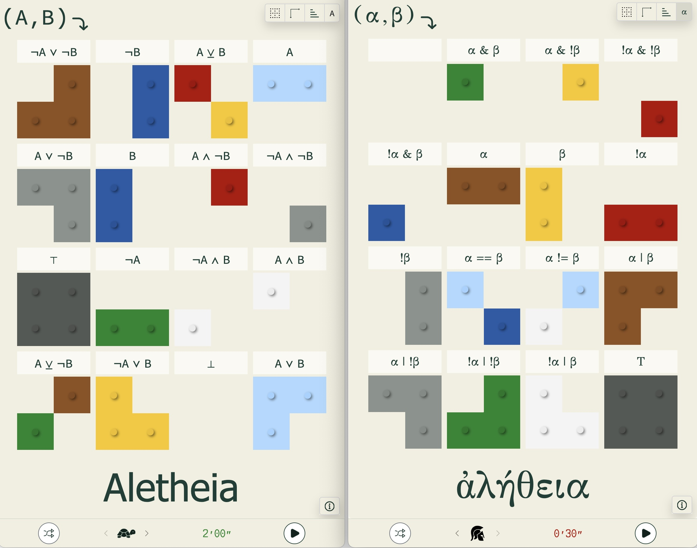

# ἀλήθεια

 

La référence à Martin Heidegger est flagrante : « <i>En traduisant ἀλήθεια par Unverborgenheit, dévoilement ou plutôt non-voilement, et non plus simplement par “Vérité”, Heidegger s'efforce de faire entendre quelque chose du sens, de ce vers quoi ἀλήθεια faisait signe, même à l'insu des Grecs, et à partir duquel ils déployaient leur monde.</i> » [⁽¹⁾](https://fr.wikipedia.org/wiki/Al%C3%A8theia_dans_la_philosophie_de_Martin_Heidegger).

Il s'agit donc de dévoiler les petites briques colorées pour faire apparaître ce que l'on appelle les tables de vérité [⁽²⁾](https://fr.wikipedia.org/wiki/Table_de_v%C3%A9rit%C3%A9) en jargon mathématique.

--- 

### Niveaux

&nbsp;&nbsp;&nbsp;`Tortue` Le joueur a 2 minutes pour dévoiler les briques.

&nbsp;&nbsp;&nbsp;`Lièvre` Le joueur a 1 minute pour dévoiler les briques.

&nbsp;&nbsp;&nbsp;`Casque Corinthien` Ce pourrait être celui d'Achille - **la** référence en matière de super-héros - mais aussi celui d'Hermès, le messager des dieux, réputé pour sa vitesse. On va en avoir besoin, car il ne reste plus que 30 secondes pour dévoiler les briques.

La 🎵musique🎶 du niveau 
est sur [SoundCloud](https://soundcloud.com/christophe-thiebaud/aletheia?si=83569a3c774e4cdf84c684e74478af34&utm_source=clipboard&utm_medium=text&utm_campaign=social_sharing)

--- 

### Résultats

1. `You won!` Toutes les briques (32) sont dévoilées dans le temps imparti, sans erreurs.
2. `You - quasi - won…` Toutes les briques sont dévoilées dans le temps imparti, avec erreurs.
3. `Time's up!` Le temps imparti est écoulé, et il reste au moins une brique à dévoiler.
4. `Rather quiet today, isn't it?` Le temps imparti est écoulé et le joueur s'est endormi sans cliquer nulle part.
5. `You cheated?!` Le joueur a cliqué sur toutes les cases sans distinction. Bien que toutes les briques ont été dévoilées dans le temps imparti, ce qui pourrait être considéré comme une victoire, le nombre d'erreurs est énorme (>=28), il a triché! C'est mal.
6. `Ooooh… Subtle!` Le joueur a joué au qui-perd-gagne. Toutes les erreurs possibles (32) ont été faites, tout en évitant soigneusement de dévoiler la moindre brique. Très fort.

Chaque résultat est accompagné d'un son différent.

--- 

### Représentations

La formule qui donne la clé de chaque de table de vérité peut être exprimée, soit avec des [symboles logiques](https://fr.wikipedia.org/wiki/Liste_de_symboles_logiques), par exemple `𝖠 ∧ 𝖡`, soit par une expression javascript, comme `α & β` . Il est intéressant de noter que dans ce dernier cas, l'expression est factuellement interprétée dans une [fonction anonyme](https://fr.wikipedia.org/wiki/Fonction_anonyme) par le moteur javascript de l'application: (α, β) => **α & β**.

|  | symboles logiques | javascript | |
|---|---|---|---|
| TOUJOURS FAUX       | `⊥`       | ` `                          |  □&nbsp;□ □&nbsp;□</kbd>  |
| A ET B              | `𝖠 ∧ 𝖡`   | `α & β`                      |  ■ □ □ □   |
| A ET NON B          | `𝖠 ∧ ¬𝖡`  | `α & !β`                     |  □ ■ □ □   |
| NON A ET B          | `¬𝖠 ∧ ¬𝖡` | `!α & !β`                    |  □ □ □ ■   |
| NON A ET NON B      | `¬𝖠 ∧ 𝖡`  | `!α & β`                     |  □ □ ■ □   |
| A                   | `𝖠`       | `α`                          |  ■ ■ □ □   |
| B                   | `𝖡`       | `β`                          |  ■ □ ■ □   |
| NON A               | `¬𝖠`      | `!α`                         |  □ □ ■ ■   |
| NON B               | `¬𝖡`      | `!β`                         |  □ ■ □ ■   |
| A OU EXCLUSIF B     | `𝖠 ⊻ 𝖡`   | `α == β`, une astuce pour contourner `α & β \| !α & !β` |  ■ □ □ ■ |
| A OU EXCLUSIF NON B | `𝖠 ⊻ ¬𝖡`  | `α != β`, idem  `α & !β \| !α & β` |  □ ■ ■ □ |
| A OU B              | `𝖠 ∨ 𝖡`   | `α \| β`                     |  ■ ■ ■ □   |
| A OU NON B          | `𝖠 ∨ ¬𝖡`  | `α \| !β`                    |  ■ ■ □ ■   |
| NON A OU NON B      | `¬𝖠 ∨ ¬𝖡` | `!α \| !β`                   |  ■ □ ■ ■   |
| NON A OU B          | `¬𝖠 ∨ 𝖡`  | `!α \| β`                    |  □ ■ ■ ■   |
| TOUJOURS VRAI       | `⊤`       | `true`                       |  ■ ■ ■ ■   |

--- 

### Raccourcis clavier

* <kbd>Space</kbd> Démarre &nbsp;&nbsp; ou arrête &nbsp;&nbsp; une partie. Si les résultats de la partie précédente sont encore affichés dans la boite de dialogue, mélange les tables avant de redémarrer. 
* <kbd>Escape</kbd> 'Tue' une partie (i.e. sans afficher les résultats). 
* <kbd>Q</kbd> &nbsp;&nbsp;&nbsp;&nbsp;&nbsp;&nbsp; Affiche les bords des tables et des celulles.
* <kbd>W</kbd> &nbsp;&nbsp;&nbsp;&nbsp;&nbsp;&nbsp; Affiche les en-têtes des axes des tables.
* <kbd>E</kbd> &nbsp;&nbsp;&nbsp;&nbsp;&nbsp;&nbsp; Groupe les tables par nombre de briques en ordre croissant.
* <kbd>S</kbd> &nbsp;&nbsp;&nbsp;&nbsp;&nbsp;&nbsp; Mélange les tables aléatoirement.
* <kbd>C</kbd> Mélange les couleurs des briques aléatoirement.
* <kbd>O</kbd> Retour à l'ordre initial des tables.
* <kbd>A</kbd> Change la représentation des en-têtes des tableaux entre symboles logiques ou javascript.

--- 

### Bascules 

'Bascule' est le mot français officiellement utilisé pour traduire l'anglais 'Toggle':

* &nbsp;&nbsp;&nbsp; Affiche les bords des tables et des celulles.
* &nbsp;&nbsp;&nbsp; Affiche les en-têtes des axes des tables.
* &nbsp;&nbsp;&nbsp; Groupe les tables par nombre de briques en ordre croissant.
* `𝖠` ou `α` Change la représentation des en-têtes des tableaux entre symboles logiques ou javascript.

--- 

